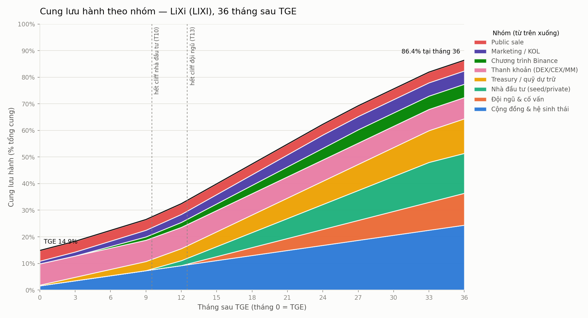

# Lịch unlock LiXi (LIXI) — 36 tháng

_File này được sinh tự động bởi `unlock_schedule.py`; sửa `config` rồi chạy lại, không sửa tay._

## Tóm tắt

- Tổng cung: **1,000,000,000 LIXI** (cố định)
- Lưu hành tại TGE (tháng 0): **148,600,000** = **14.86%** tổng cung
- Lưu hành cuối tháng 3: 183,216,667 = 18.32%
- Lưu hành cuối tháng 6: 224,083,333 = 22.41%
- Lưu hành cuối tháng 12: 324,566,667 = 32.46%
- Lưu hành cuối tháng 24: 623,033,333 = 62.30%
- Lưu hành cuối tháng 36: 864,000,000 = 86.40%
- Tháng unlock mạnh nhất so với lưu hành tháng trước: tháng 1 (7.77%, 11,538,889 token)
- Nhóm chưa mở hết trong khoảng tính: Cộng đồng & hệ sinh thái (xong tháng 48), Đội ngũ & cố vấn (xong tháng 48)

## Phân bổ và vesting

| Nhóm | Role | % tổng cung | Số token | Mở tại TGE (% nhóm) | Cliff (tháng) | Vesting (tháng) | Mở hết tại tháng | Ghi chú |
|---|---|---:|---:|---:|---:|---:|---:|---|
| Cộng đồng & hệ sinh thái | `community` | 32% | 320,000,000 | 5% | 0 | 48 | 48 | Airdrop, quest, grant. Tuyến tính 48 tháng, phần TGE cho airdrop người dùng sớm. |
| Đội ngũ & cố vấn | `team` | 18% | 180,000,000 | 0% | 12 | 36 | 48 | Bắt buộc 0% tại TGE. Cliff 12 tháng, tuyến tính 36 tháng. |
| Nhà đầu tư (seed/private) | `investors` | 15% | 150,000,000 | 0% | 9 | 24 | 33 | Cliff 9 tháng để tháng đầu sau cliff không trùng cliff đội ngũ (tháng 13) và mốc Binance (tháng 4). |
| Treasury / quỹ dự trữ | `treasury` | 13% | 130,000,000 | 2% | 0 | 36 | 36 | Multisig 3/5, timelock 48h. Mô hình hóa tuyến tính 36 tháng; thực tế chi theo đề xuất quản trị. |
| Thanh khoản (DEX/CEX/MM) | `liquidity` | 8% | 80,000,000 | 100% | 0 | 0 | 0 | Toàn bộ tại TGE để tạo pool PancakeSwap và cấp cho MM. LP phải khóa >= 12 tháng. |
| Chương trình Binance | `binance` | 5% | 50,000,000 | 0% | 3 | 24 | 27 | Airdrop Alpha / Launchpool / HODLer. Giữ riêng; mô hình hóa giải ngân từ tháng 4 trong 24 tháng. |
| Marketing / KOL | `marketing` | 5% | 50,000,000 | 20% | 0 | 24 | 24 | 20% của nhóm = 1% tổng cung tại TGE. Hợp đồng KOL phải có vesting. |
| Public sale | `public` | 4% | 40,000,000 | 100% | 0 | 0 | 0 | Mở khóa toàn bộ tại TGE. Giá không thấp hơn vòng private quá xa. |
| **Tổng** | | **100%** | **1,000,000,000** | | | | | |

## Lịch unlock theo tháng (đơn vị: triệu token)

Cột theo nhóm là số token mở khóa **trong** tháng đó; lũy kế từng nhóm xem trong `schedule.csv`.

| Tháng | Cộng đồng & hệ sinh thái | Đội ngũ & cố vấn | Nhà đầu tư (seed/private) | Treasury / quỹ dự trữ | Thanh khoản (DEX/CEX/MM) | Chương trình Binance | Marketing / KOL | Public sale | Tổng mở trong tháng | Lưu hành | % tổng cung | Unlock / lưu hành tháng trước |
|---:|---:|---:|---:|---:|---:|---:|---:|---:|---:|---:|---:|---:|
| 0 (TGE) | 16.00M | – | – | 2.60M | 80.00M | – | 10.00M | 40.00M | 148.60M | 148.60M | 14.86% | – |
| 1 | 6.33M | – | – | 3.54M | – | – | 1.67M | – | 11.54M | 160.14M | 16.01% | 7.77% |
| 2 | 6.33M | – | – | 3.54M | – | – | 1.67M | – | 11.54M | 171.68M | 17.17% | 7.21% |
| 3 | 6.33M | – | – | 3.54M | – | – | 1.67M | – | 11.54M | 183.22M | 18.32% | 6.72% |
| 4 | 6.33M | – | – | 3.54M | – | 2.08M | 1.67M | – | 13.62M | 196.84M | 19.68% | 7.44% |
| 5 | 6.33M | – | – | 3.54M | – | 2.08M | 1.67M | – | 13.62M | 210.46M | 21.05% | 6.92% |
| 6 | 6.33M | – | – | 3.54M | – | 2.08M | 1.67M | – | 13.62M | 224.08M | 22.41% | 6.47% |
| 7 | 6.33M | – | – | 3.54M | – | 2.08M | 1.67M | – | 13.62M | 237.71M | 23.77% | 6.08% |
| 8 | 6.33M | – | – | 3.54M | – | 2.08M | 1.67M | – | 13.62M | 251.33M | 25.13% | 5.73% |
| 9 | 6.33M | – | – | 3.54M | – | 2.08M | 1.67M | – | 13.62M | 264.95M | 26.50% | 5.42% |
| 10 | 6.33M | – | 6.25M | 3.54M | – | 2.08M | 1.67M | – | 19.87M | 284.82M | 28.48% | 7.50% |
| 11 | 6.33M | – | 6.25M | 3.54M | – | 2.08M | 1.67M | – | 19.87M | 304.69M | 30.47% | 6.98% |
| 12 | 6.33M | – | 6.25M | 3.54M | – | 2.08M | 1.67M | – | 19.87M | 324.57M | 32.46% | 6.52% |
| 13 | 6.33M | 5.00M | 6.25M | 3.54M | – | 2.08M | 1.67M | – | 24.87M | 349.44M | 34.94% | 7.66% |
| 14 | 6.33M | 5.00M | 6.25M | 3.54M | – | 2.08M | 1.67M | – | 24.87M | 374.31M | 37.43% | 7.12% |
| 15 | 6.33M | 5.00M | 6.25M | 3.54M | – | 2.08M | 1.67M | – | 24.87M | 399.18M | 39.92% | 6.64% |
| 16 | 6.33M | 5.00M | 6.25M | 3.54M | – | 2.08M | 1.67M | – | 24.87M | 424.06M | 42.41% | 6.23% |
| 17 | 6.33M | 5.00M | 6.25M | 3.54M | – | 2.08M | 1.67M | – | 24.87M | 448.93M | 44.89% | 5.87% |
| 18 | 6.33M | 5.00M | 6.25M | 3.54M | – | 2.08M | 1.67M | – | 24.87M | 473.80M | 47.38% | 5.54% |
| 19 | 6.33M | 5.00M | 6.25M | 3.54M | – | 2.08M | 1.67M | – | 24.87M | 498.67M | 49.87% | 5.25% |
| 20 | 6.33M | 5.00M | 6.25M | 3.54M | – | 2.08M | 1.67M | – | 24.87M | 523.54M | 52.35% | 4.99% |
| 21 | 6.33M | 5.00M | 6.25M | 3.54M | – | 2.08M | 1.67M | – | 24.87M | 548.42M | 54.84% | 4.75% |
| 22 | 6.33M | 5.00M | 6.25M | 3.54M | – | 2.08M | 1.67M | – | 24.87M | 573.29M | 57.33% | 4.54% |
| 23 | 6.33M | 5.00M | 6.25M | 3.54M | – | 2.08M | 1.67M | – | 24.87M | 598.16M | 59.82% | 4.34% |
| 24 | 6.33M | 5.00M | 6.25M | 3.54M | – | 2.08M | 1.67M | – | 24.87M | 623.03M | 62.30% | 4.16% |
| 25 | 6.33M | 5.00M | 6.25M | 3.54M | – | 2.08M | – | – | 23.21M | 646.24M | 64.62% | 3.72% |
| 26 | 6.33M | 5.00M | 6.25M | 3.54M | – | 2.08M | – | – | 23.21M | 669.44M | 66.94% | 3.59% |
| 27 | 6.33M | 5.00M | 6.25M | 3.54M | – | 2.08M | – | – | 23.21M | 692.65M | 69.27% | 3.47% |
| 28 | 6.33M | 5.00M | 6.25M | 3.54M | – | – | – | – | 21.12M | 713.77M | 71.38% | 3.05% |
| 29 | 6.33M | 5.00M | 6.25M | 3.54M | – | – | – | – | 21.12M | 734.89M | 73.49% | 2.96% |
| 30 | 6.33M | 5.00M | 6.25M | 3.54M | – | – | – | – | 21.12M | 756.02M | 75.60% | 2.87% |
| 31 | 6.33M | 5.00M | 6.25M | 3.54M | – | – | – | – | 21.12M | 777.14M | 77.71% | 2.79% |
| 32 | 6.33M | 5.00M | 6.25M | 3.54M | – | – | – | – | 21.12M | 798.26M | 79.83% | 2.72% |
| 33 | 6.33M | 5.00M | 6.25M | 3.54M | – | – | – | – | 21.12M | 819.38M | 81.94% | 2.65% |
| 34 | 6.33M | 5.00M | – | 3.54M | – | – | – | – | 14.87M | 834.26M | 83.43% | 1.82% |
| 35 | 6.33M | 5.00M | – | 3.54M | – | – | – | – | 14.87M | 849.13M | 84.91% | 1.78% |
| 36 | 6.33M | 5.00M | – | 3.54M | – | – | – | – | 14.87M | 864.00M | 86.40% | 1.75% |

## Kiểm tra red flag

| Kết quả | Quy tắc | Số liệu |
|---|---|---|
| **PASS** | Tổng phân bổ = 100% | tổng = 100.0000% |
| **PASS** | Đội ngũ 0% tại TGE | Đội ngũ & cố vấn: TGE unlock = 0% của nhóm |
| **PASS** | Đội ngũ + nhà đầu tư <= 40% | đội ngũ 18% + nhà đầu tư 15% = 33% |
| **PASS** | Không tháng nào unlock > 8% lưu hành tháng trước | cao nhất: tháng 1 = 7.77% |
| **PASS** | Lưu hành tại TGE trong [8%, 25%] | TGE = 14.86% tổng cung (148,600,000 token) |
| **PASS** | Có nhóm thanh khoản (LP) | Thanh khoản (DEX/CEX/MM): 8% tổng cung, TGE 100% của nhóm |
| **PASS** | Unlock 3 tháng đầu <= 30% lưu hành TGE | tháng 1–3 mở 3.46% tổng cung = 23.30% lưu hành TGE |

**7 PASS, 0 WARN.** Không có red flag theo các quy tắc trên.

